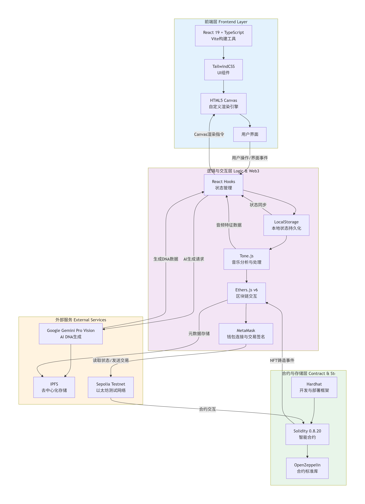
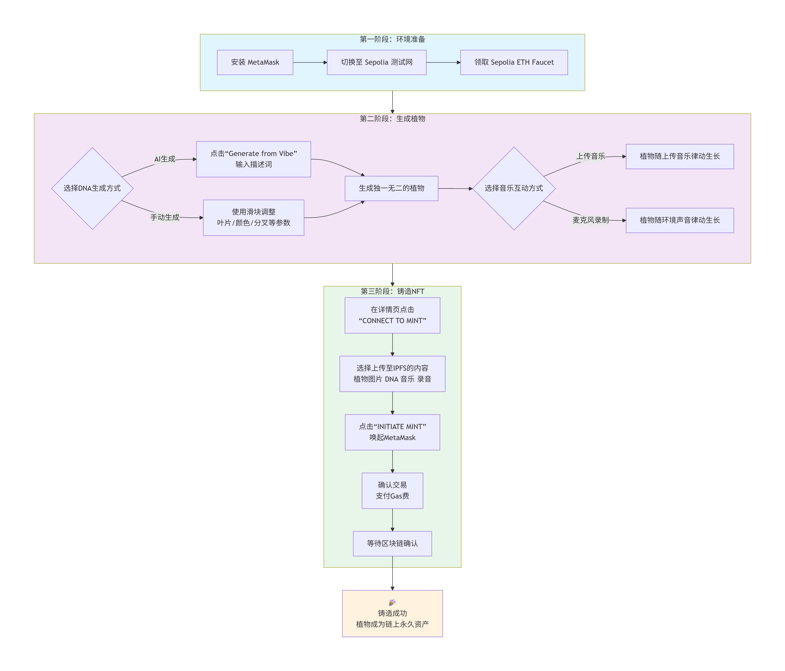

# 🌱 Chain Garden

源代码仓库：
https://github.com/chenqing0106/Chain-Garden

## 一、产品愿景 (Product Vision)


**"让瞬间的灵感，生长为永恒的美丽"**


Chain Garden 致力于探索 **生成式艺术 (Generative Art)**、**人工智能 (AI)** 与 **Web3 技术** 的交叉点。我们的愿景是将无形的“声音”与抽象的“情绪”转化为可视化的数字植物。

每一株植物都是独一无二的：它的 DNA 来自 AI 解析的文字意象，它的生长则是随着用户上传的声音或者音频文件变化。通过区块链技术，这些数字生命被永久确权，构建一个由社区共创的、去中心化的数字植物园。

  

---


## 二、核心功能 (Core Features)

  
### 1. 🎵 多模态驱动生成 (Audio & AI Driven)

  

- **音频频谱分析**：通过 Tone.js 实时捕捉麦克风声音或上传的音频文件，提取低音、中音、高音特征，映射为植物的生长参数（如分枝密度、生长速度）。

- **AI 语义转化**：集成 **Google Gemini API**，用户输入一段文字（如“赛博朋克森林”或“宁静的午后”），AI 将其转化为植物的 DNA 参数（颜色、叶片形状、生长架构）。


### 2. 🌿 程序化植物生长引擎

  

基于分形算法与数学模型，支持多种生长架构：

  
- **分形树 (Fractal Tree)**: 经典的递归分叉结构，适合表现树状、分支丰富的样式。

- **有机藤蔓 (Organic Vine)**: 蜿蜒生长的曲线形态，常表现为延伸与盘绕。`

- **径向多肉 (Radial)**: 从中心向四周对称扩散的几何美感，适合多肉类或放射状生长。

- **蕨类 (Fern)**: 自相似的羽状结构，展示自然界的重复与比例。

- **垂柳样 (Weeping Willow)**: 具有下垂、垂坠感的长条生长结构，适合表现柔软挂落的枝条。

- **异形灌木 (Alien Shrub)**: 更具抽象或科幻感的灌木状结构，支持非常规参数以产生奇异外观。

- **晶体仙人掌 (Crystal Cactus)**: 具有几何/晶体化分叉的多肉类表现，用于生成角度分明的结构。

- **数据花 (Data Blossom)**: 从数值/音频数据直接映射为花瓣或辐射形态的生成式结构，适合可视化数据驱动生长。
  

### 3. ⛓️ NFT 铸造与确权

  

- **ERC-721 标准**：每一株植物都可以铸造为以太坊（Sepolia 测试网）上的 NFT。

- **去中心化存储**：植物的元数据（属性、DNA）和图像通过 **IPFS** (Pinata/Web3.Storage) 进行永久存储，确保数据不可篡改且不依赖中心化服务器。

  
---

  

## 三、核心创新点

  

### 0. 用户故事：看不见的“情绪”如何被疗愈？

  

>**痛点 :** 快节奏的生活中，自我疗愈的时刻是经常被需要的，而这种时刻往往是**稍纵即逝**的、**无形**的。当我们想纪录或者表达此刻的烦恼或者喜悦，录音文件能提供的只是冰冷的数据，无法承载声音中蕴含的生命力；而市面上的 NFT 只是交易的代码，缺乏情感的温度。


>**Chain Garden 能提供的：** 当我们为生活的压力感到窒息，又找不到发泄口时，打开 Chain Garden，对着麦克风，可以隐秘而无所顾忌地表达自己的情绪。屏幕上，一颗种子随之破土而出，叶片随着我们的呼吸节奏舒展。几分钟后，一株独一无二的数字生命诞生了。将其铸造上链——这不仅是 NFT，更是我们情绪治愈时刻的**永恒凭证**。

  
---

  

### 1. 🎵 跨模态“通感”算法：从听觉到视觉的生命映射

  

**—— 解决痛点：传统生成式艺术是“随机黑盒”，用户缺乏参与感与掌控感。**

  

不同于传统 NFT 项目使用随机种子（Random Seed）生成图像，Chain Garden 创新性地构建了一套**“声波-生物形态映射引擎”**。

  

* 实现了**“所听即所见”**的通感体验。用户的声音直接决定了植物的长相，这让 NFT 的生成过程不再是机器的抽奖，而是用户灵魂的投射。

  


### 2. 🌿 Web3 时代的“数字声音疗愈”

  

**—— 解决痛点：Web3 世界充满了焦虑与躁动，缺乏具有人文关怀和心理疗愈属性的应用。**

  

Chain Garden 首次提出了 **“链上冥想”** 的产品理念。

  

* **视觉生物反馈 (Visual Biofeedback)**：当用户通过声音控制植物生长时，植物舒缓的生长动画会形成一种视觉反馈，引导用户调整呼吸，达到与声音疗愈（Sound Bath）相似的减压效果。

* **情绪资产化 (Emotional Assets)**：我们将“疗愈的过程”资产化。用户铸造的每一株植物，都是一次冥想练习的记录。

* **创新价值**：**从“Play-to-Earn”转向“Play-to-Heal”**。我们利用区块链技术的“永存性”，保存的不是金融价值，而是用户珍贵的平静时刻。

### 3. 💾 链上永生：代码即生命 (Code is Life)

**—— 解决痛点：Web2 资产的中心化依赖与“死数据”问题。**

- **Web2 做不到的**：传统应用保存的往往是一张静态的图片（死图）或托管在中心化服务器上的文件。**哪怕你的网站倒闭了，图片链接失效，那些记忆也就随之消失。**
    
- **Web3 的永恒逻辑**：Chain Garden 存储的不是一张图，而是**“永恒的代码逻辑”**。我们将生成植物的数学参数（DNA）与种子（Seed）完整刻录在区块链上。
    
- **复现性 (Reproducibility)**：**只要区块链还在，任何人拿到这串链上参数，都能在任何地方（哪怕是本地浏览器）运行代码，1:1 完美复现出那株一模一样的植物。** 这赋予了数字生命真正的独立性——它不再依赖于 Chain Garden 项目方而存活。

---


## 四、技术架构 (Technical Architecture)

```

chain-garden/

├── contracts/                 # 智能合约代码

│   └── ChainGardenNFT.sol    # ERC-721 NFT合约

├── scripts/                   # 部署脚本

│   └── deploy.js             # 合约部署脚本

├── front/                       # React前端代码

│   ├── components/           # React组件

│   │   ├── MintModal.tsx

│   │   ├── PlantCanvas.tsx

│   │   └── SpecimenDetailModal.tsx

│   ├── services/             # 服务层

│   │   ├── audioService.ts   # 音频分析服务

│   │   ├── geminiService.ts  # Gemini AI服务

│   │   ├── plantMusicService.ts # 植物音乐生成

│   │   ├── ipfsService.ts # ipfs去中心化处理

│   │   └── web3Service.ts    # Web3交互服务

│   ├── App.tsx               # 主应用组件

│   ├── index.tsx             # 入口文件

│   └── types.ts              # TypeScript类型定义

├── hardhat.config.js         # Hardhat配置

├── package.json              # 项目依赖（Hardhat）

└── README.md                 # 项目文档

```

项目采用现代化的 Web3 全栈架构：

  

### 1. 前端层 (Frontend)


- **框架**：React 19 + TypeScript + Vite

- **UI 组件**：TailwindCSS

- **视觉渲染**：HTML5 Canvas API (自定义渲染引擎)

- **AI 服务**：Google Gemini Pro Vision integration

- **音乐处理**：Tone.js


### 2. 逻辑与交互层 (Logic & Web3)

  
- **区块链交互**：Ethers.js v6

- **钱包连接**：MetaMask (Injected Provider)

- **状态管理**：React Hooks + LocalStorage

  

### 3. 合约与存储层 (Contract & Storage)

- **智能合约**：Solidity 0.8.20 (基于 OpenZeppelin)

- **开发框架**：Hardhat

- **网络**：Sepolia Testnet

- **元数据存储**：IPFS (InterPlanetary File System)

  
---

  

## 五、使用指南 (User Guide)


### 1. 环境准备

  

- 安装 **MetaMask** 浏览器插件。

- 切换至 **Sepolia 测试网**。

- 确保账户内有少量的 Sepolia ETH（可通过 Faucet 获取）用于支付 Gas 费。

  

### 2. 生成植物

  

- **DNA生成方式**

1）AI 生成：点击 "Generate from Vibe"，输入描述词（如 "Jazz music visual"），AI 将为您生成专属 DNA。

2）手动参数：通过滑块调整叶片形状、颜色盘、分叉系数等 DNA 参数。

- **植物生长方式**：上传音乐或开启麦克风，植物将随声音节奏律动生长。

  

### 3. 铸造 NFT

  

1. 植物保存后，在生成的植物详情页点击 **"CONNECT TO MINT"**。

2. 可以选择将植物图片（必选），DNA，音乐，录音上传至 IPFS，点击 **“INITIATE MINT”**。

3. 唤起 MetaMask 钱包，确认交易（支付少量测试币）。

4. 等待区块链确认，您的植物即成为链上永久资产。

  

---

  

## 六、实操演示 (Demo / Deployment)

部署地址：
https://chain-garden.vercel.app/

详见原仓库README以及演示视频

---

  

## 七、后续计划 (Roadmap)

### 1. 产品形态拓展：从“盆栽”到“生活伴侣”

- **移动端适配 (Mobile First)**
    
    - 绝大部分“发声”和“情绪宣泄”的场景发生在手机上。开发 PWA 或移动端原生应用，让用户随时随地记录情绪种子。
        
- **桌面动态壁纸 (Desktop Companion)**
    
    - **“数字盆栽”桌面化**：开发 Mac/Windows 桌面插件。用户铸造的植物不仅仅在网页中沉睡，而是可以作为**动态壁纸**在桌面上实时渲染，随着背景音乐轻轻摆动，提供长期的陪伴与疗愈。
        

### 2. 深度链上交互：钱包即土壤，行为即年轮

- **钱包即土壤 (Wallet as Soil)**
    
    - 用户的链上历史行为直接影响植物的“表型”。例如，DeFi 交互频繁的钱包，植物可能长出金属质感的刺；持有蓝筹 NFT 的钱包，植物可能带有特殊的光晕。
        
- **行为年轮系统 (Growth Rings)**
    
    - 引入**“生物年轮”**概念：植物的年轮不再仅仅代表时间，而是记录用户行为的日记。每一次链上交互、每一段新的录音注入，都会在植物的主干上留下一圈独特的纹理或色彩，让植物成为用户数字生命的编年史。
        

### 3. 社交与生态：构建“情绪森林”

- **多植物生态花园 (User Emotion Forest)**
    
    - 从单株展示升级为生态系统。用户可以查看自己过去一个月生成的所有植物，它们汇聚成一片森林。通过森林的茂密程度与色调变化，直观地通过**可视化 (Visualization)** 回顾自己近期的情绪起伏曲线。
        
- **多人共同栽培模式 (Co-Cultivation)**
    
    - **亲密关系互动**：支持双人模式（如情侣、挚友），两人分别输入不同的音轨或声音，共同浇灌同一株植物。这株植物将融合两人的声音特征，成为关系的数字见证。
        
- **社交树洞区 (Social Hollow)**
    
    - **公开森林 (Public)**：用户可将植物移植到“公共花园”，展示自己的艺术创作，他人可点赞或“浇水”。
        
    - **私密树洞 (Secret)**：设置为仅自己可见的“秘密花园”，作为私密的宣泄出口。亦可支持**匿名漂流瓶**模式——陌生人捡到你的植物种子，听到你的故事，并为你生成一株新的植物作为回信。


### 4. 寻找垂直场景进行小范围推广

- **场景 A：独立音乐人/播客创作者 (The Creators)**
    
    - **可视化封面**：生成的植物可作为 Demo、单曲或播客新栏目的独特视觉封面。
        
- **场景 B：冥想与瑜伽社群 (The Healers)**
    
    - **结业纪念**：在冥想课程结束后的分享环节，邀请学员录制感悟，生成“情绪植物”作为课程结业的 NFT 纪念。
        
- **场景 C：特殊日期的“声音礼物” (The Gifters)**
    
    - **可回放的礼物**：生成的植物 NFT 链接可作为礼物发送。接收者打开链接，不仅能看到植物生长，还能回放那段祝福声音（音频哈希存入元数据）。

### 5. 价值流转：去中心化植物交易所 (Marketplace)

- **情感资产的“领养”机制 (Adoption over Trading)**
    
    - 建立原生的 **Garden Marketplace**。在这里，交易不只是冷冰冰的买卖，而是对他人情感故事的“领养”。用户可以浏览不同风格的植物（如“忧郁蓝调”、“热烈摇滚”），找到与自己当下心境共鸣的植物进行收藏。
        
- **创作者版税标准 (EIP-2981 Royalties)**
    
    - 合约层集成 **EIP-2981** 标准。当植物被二次流转时，原始培育者（Gardener）将获得持续的版税收益。这鼓励用户创作更具美感或故事性的植物，构建可持续的创作者经济。

**Chain Garden Team**

**