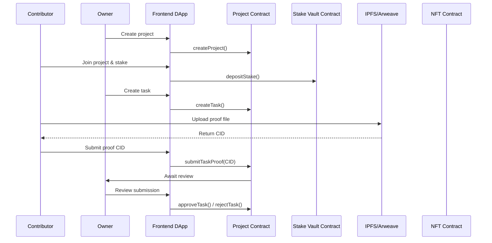

# **PRD — Cocreate: A Stake-Based Web3 Collaboration Tool**

**Version:** 1.0

**Owner:** Mira

**Product Name:** Cocreate

**Goal:** Build an MVP for a minimal Web3 collaboration tool that uses **stake-backed commitment + on-chain contribution records**.

**Primary Scenarios:** Hackathons, small project teams, DAO working groups.

---

# 1. 🎯 Background & Objectives

Team collaboration frequently breaks down due to:

- **Missed deadlines and unclear accountability**
- **Owners unable to verify whether work was actually completed**
- **Contributions that can’t be measured and no on-chain reputation**
- **Opaque project fund flows**

To address this, we propose an MVP where:

> Every member stakes a deposit when joining a project.
> 
> 
> To mark a task as complete, contributors submit verifiable proof (IPFS).
> 
> Once approved, their stake is returned and a contribution NFT is minted.
> 
> If the submission is rejected, their stake is forfeited.
> 

**Core value propositions:**

- **Reduces flaking and reinforces responsibility**
- **Contributions become verifiable and traceable on-chain**
- **Smart contracts handle automatic settlement**
- **Collaboration becomes transparent and trustworthy**

---

# 2. 👤 User Personas

## Persona A: Project Creator / Owner

- Wants to assemble a small Web3 team (hackathon, DAO, working group)
- Values transparency, accountability, and automation
- Not deeply technical, but comfortable signing transactions
- Wants to avoid situations where tasks stall or members disappear

## Persona B: Contributor / Team Member

- Wants to join projects where rules are clearly defined
- Wants to build on-chain credibility and contribution proof (NFTs)
- Wants protection from potential abuse by the project owner
- Wants immediate visibility into whether their work was approved

---

# 3. 🧭 User Stories (Minimal MVP)

## EPIC:

Enable trustworthy collaboration, verifiable contribution, and automatic fund settlement.

---

### **User Story 1: Owner Creates a Project**

**As** an Owner

**I want** to create a project and define the stake requirement

**So that** contributors join with a clear sense of commitment

**Acceptance Criteria:**

- Enter project name, description, and stake amount
- A `projectId` is created on-chain
- Redirect to the project dashboard

---

### **User Story 2: Contributor Joins & Stakes**

**As** a Contributor

**I want** to join the project and stake a deposit

**So that** my commitment is formalized and I become part of the team

**Acceptance Criteria:**

- Click “Join”
- Wallet pops up → Confirm stake
- Successfully joined → Appears in the member list

---

### **User Story 3: Submit Task & Proof (IPFS)**

**As** a Contributor

**I want** to upload my task deliverable

**So that** the owner can review it and credit my contribution

**Acceptance Criteria:**

- Upload file → Automatically uploaded to IPFS
- CID recorded on-chain
- Task status updates to “Pending Review”

---

### **User Story 4: Owner Reviews Submission**

**As** an Owner

**I want** to view the submitted proof and approve or reject it

**So that** I can trigger stake return or contribution minting

**Acceptance Criteria:**

- Approve → Mint NFT + stake unlocked
- Reject → Stake remains frozen / forfeited
- All statuses updated on-chain

---

### **User Story 5: Project Finalization & Fund Settlement**

**As** an Owner

**I want** to finalize the project with one click

**So that** all stakes can be returned or penalized automatically

**Acceptance Criteria:**

- Approved contributors → stake automatically returned
- Failed contributors → stake forfeited
- Display project fund flows and distribution summary

---

# ✅ 1. User Flow Diagram (Mermaid)

```html
flowchart TD

A[Owner creates project] --> B[Members join and stake]
B --> C[Owner creates tasks]
C --> D[Members submit proof (IPFS)]
D --> E[Team or multisig reviews tasks]
E -->|Approved| F[Mint completion NFT]
E -->|Rejected| C

F --> G[All tasks complete / Project ends]
G --> H{Any defaulting members?}
H -->|No| I[Return all stakes]
H -->|Yes| J[Forfeit defaulted stakes]

I --> K[Distribute any project earnings]
J --> K
K --> L[Project completed]

```

---

# ✅ 2. Data Flow Diagram (Mermaid)



---

If you'd like, I can also:

- rewrite this as a **Notion-ready PRD**,
- turn it into a **GitHub README**,
- or convert it into a **pitch deck** for hackathons.

# 3. Project Directory Structure (Hardhat / Foundry Friendly)

Below is the recommended structure (optimized for **Hardhat**, ideal for hackathons):

```
/web3-collab-mvp
│
├── contracts/
│   ├── ProjectFactory.sol
│   ├── Project.sol
│   ├── StakeVault.sol
│   ├── TaskNFT.sol
│   └── interfaces/
│       ├── IProject.sol
│       ├── IStakeVault.sol
│       └── ITaskNFT.sol
│
├── scripts/
│   ├── deploy.ts
│   ├── createProject.ts
│   └── interactExamples.ts
│
├── test/
│   ├── Project.test.ts
│   ├── StakeVault.test.ts
│   └── TaskNFT.test.ts
│
├── frontend/
│   ├── pages/
│   ├── components/
│   ├── hooks/
│   └── utils/
│
├── utils/
│   ├── ipfs.ts
│   └── formatters.ts
│
├── README.md
└── hardhat.config.ts

```

---

# 4. 🌕 Design Philosophy

### 1) Minimal & Transparent

In Web3, **trust is everything** — the UI must surface all critical state *immediately*:

- Stake amount
- Task status (Pending / Submitted / Under Review / Approved / Rejected)
- Which members have staked
- Where funds currently are (Vault state)

---

### 2) Reduce Web3 Noise

- Before any wallet action → show **“What you’re about to do on-chain”**
- After any action → show **transaction hash & explorer link**
- UI should anticipate the user’s next step

---

### 3) Verifiable by Design

Everything should be provable end-to-end:

- Proof upload → IPFS link
- Review → Owner / multisig
- Contribution → NFT mint
- All states → on-chain & traceable

---

### 4) Gamified, but Credible

Light gamification to boost clarity & enjoyment:

- Dashboard = **Quest Board**
- Each Task = **Quest Card**
- Approved Task = **Badge (NFT)**

Fun and motivating, without reducing professionalism.

---

# 5. 🎨 Visual & Interaction Style Guide

### **Color Palette**

- Primary: Tech Purple (#6F42FF) or Neon Cyan (#39E5FF)
- Secondary: Deep Gray (#111111), Cool Black (#000000)
- Success: Green (#00D27F)
- Failure: Red (#FF5A5A)

Overall aesthetic: **high-contrast Web3 cyber-hacker vibe**.

---

### **Layout Structure**

Left: Project Navigation (Overview / Tasks / Members / Vault)

Center: Main Workspace (Task list, submission, proof viewer)

Right: On-chain State & Activity Log

Visual layout:

```
-------------------------------------------
| Nav |     Main Content     | On-chain Log |
-------------------------------------------

```

---

### **UI Components**

- **Project Card** — stake, members, status
- **Task Card** — status + submit button
- **Proof Viewer** — file preview + IPFS CID
- **On-chain State Box** — latest contract events

---

### **Interaction Model**

- Every critical action → **Modal + Wallet Popup (double confirmation)**
- Successful action → auto-redirect to updated task list
- Right-side panel shows **real-time on-chain event logs**

---

# 7. 🔧 Feature Requirements

## 7.1 Project Creation

| Feature | Description | Required |
| --- | --- | --- |
| Input project info | Name, description, stake amount | ✔ |
| Create `projectId` | Smart contract call | ✔ |
| Dashboard view | Show project state | ✔ |

---

## 7.2 Join Project + Stake

| Feature | Description | Required |
| --- | --- | --- |
| Wallet connection | WalletConnect | ✔ |
| Stake deposit | `depositStake` | ✔ |
| Member list | Show all member states | ✔ |

---

## 7.3 Submit Proof

| Feature | Description | Required |
| --- | --- | --- |
| File upload | Images / PDF / text | ✔ |
| Auto-upload to IPFS | Returns CID | ✔ |
| Submit proof | Write CID on-chain | ✔ |

---

## 7.4 Review Tasks

| Feature | Description | Required |
| --- | --- | --- |
| Preview proof | IPFS viewer | ✔ |
| Review action | Approve / Reject | ✔ |
| Update on-chain | `setTaskStatus` | ✔ |

---

## 7.5 Project Finalization & Settlement

| Feature | Description | Required |
| --- | --- | --- |
| End project | `finalizeProject` | ✔ |
| Auto-release stake | `releaseStake` | ✔ |
| Slash offenders | `slashStake` | ✔ |
| Display summary | Funds, flow, distribution | ✔ |

---

# 8. 📡 Technical Architecture (Chain + Off-chain)

### **On-chain Storage** (implemented by Nora)

- Project metadata (owner, stake amount, status)
- Member stake records
- Task states
- IPFS CIDs
- NFT minting logic
- Event logs (for The Graph indexing)

---

### **Off-chain Storage**

- Task descriptions & drafts → Supabase
- Proof files → IPFS
- Project avatars & metadata → Off-chain storage