# 🏸 BadmintonTribe: Decentralized Badminton Event Management Platform

> **Make every swing pure, make every fee transparent, let every growth and passion be remembered.**
> *A Sports Community Solution in the Web3 Era*

---

## 1. Project Background

Badminton is a popular team sport that typically requires an organizer to initiate. In Shenzhen, commercial badminton courts are expensive (e.g., the cheapest in Futian District is 120 RMB/hour). Meanwhile, the price of shuttlecocks has skyrocketed in recent years (Shenzhen's local brand "Chao Pai" Red series has reached 20 RMB/shuttlecock), making organizing badminton events increasingly difficult.

Due to the scarcity of commercial venues in Futian District, the government has opened up some school badminton courts to the public during non-school hours at a lower price of 50 RMB/hour. This was intended as a public welfare, but it has been exploited by scalpers who use automated scripts to snatch bookings and then resell spots at high prices on platforms like "Wa You Ju". This behavior is deeply hated by badminton enthusiasts.

I am a badminton lover (though not a pro). Recently, while learning Solidity, I decided to combine Web3 technology to build a badminton event organization platform and attempt to solve some common problems:

*   **Organizer Risk**: Organizers often need to advance court fees. If participants "no-show" temporarily, the organizer bears the financial loss.
*   **Opaque Funds**: The details of income and expenditure are usually known only to the organizer, making it difficult for participants to verify where the money went.
*   **Trust Cost**: Signing up for a stranger's game is like opening a blind box. Lack of knowledge about technical levels (everyone has a different understanding of amateur levels) may affect the sports experience—experts can't play fully, and beginners feel overwhelmed.

**BadmintonTribe** was born to solve these problems. By moving the event organization process onto the blockchain, utilizing the openness, transparency, and automatic execution characteristics of smart contracts, we aim to build a sports community that does not require trusted intermediaries.

---

## 2. Project Introduction (What is BadmintonTribe?)

**BadmintonTribe** is a badminton event organization platform built on blockchain technology. It is not just a registration tool, but a **decentralized fund escrow and settlement system**.

In traditional badminton events, organizers (group leaders) often face pain points such as tedious bookkeeping, difficulty collecting money, and troublesome refunds; participants also worry about the safety of prepaid fees or opaque accounts. BadmintonTribe uses Smart Contracts to completely solve these problems.

### 🌟 Core Values
*   **Fund Escrow**: Registration fees are deposited directly into the smart contract, not into the organizer's personal Alipay or WeChat account.
*   **Transparent Settlement**: After the event, the organizer must publish bills or expenses, and the contract automatically calculates the per-person cost. A publicity period is also initiated. Every transaction and refund is verifiable on-chain and tamper-proof.
*   **Dispute Resolution**: If the organizer reports false expenses, anyone can stake a deposit to initiate a challenge.
*   **Secure Refund (Pull Payment)**: Adopts a "Pull" refund design to prevent refund failures due to insufficient Gas fees or malicious attacks.

---

## 3. How it Works

It's like having an **absolutely fair, never-resting robot butler** (Smart Contract) who manages and distributes money for us.

### 3.1 🔄 Fund Flow Diagram

### 3.2 🗺️ Event Lifecycle Flowchart

```mermaid
graph TD
    %% Nodes
    Start((Start)) --> Connect[Connect Wallet]
    Connect --> Role{User Role?}
    
    %% Host Path
    Role -->|Host| Create[Create Event]
    Create --> Recruit[Recruiting: Wait for Players]
    Recruit -->|Approve Players| Ready[Event Ready]
    Ready --> Play[🏸 Activity Day]
    Play --> Settle[Submit Expense]
    Settle --> ChallengePeriod{"Challenge Period<br/>(24h)"}
    
    %% Player Path
    Role -->|Player| Browse[Browse Events]
    Browse --> Join[Join & Pay]
    Join --> Wait[Wait for Approval]
    Wait -->|Approved| Ready
    
    %% Settlement Logic
    ChallengePeriod -->|No Objection| Finalize[Finalize Settlement]
    ChallengePeriod -->|Challenge!| Admin[Admin Intervention]
    Admin --> Finalize
    
    %% End
    Finalize --> Claim[Claim Refund]
    Finalize --> Rate[Submit Rating]
    Claim --> End((End))
    Rate --> End
    
    %% Styling
    style Start fill:#f9f,stroke:#333,stroke-width:2px
    style End fill:#f9f,stroke:#333,stroke-width:2px
    style Role fill:#ff9,stroke:#333
    style Play fill:#bfb,stroke:#333
```

---

## 4. Key Features

### ✅ 4.1 Simple Registration (Join & Pay)
No need to spam messages in WeChat groups. Connect your wallet, click "Join Event", pay USDT, and lock your spot in one step.

### 🛡️ 4.2 No-Show Protection
Registration requires full pre-payment. If someone "no-shows" temporarily, they still share the court fee, protecting the interests of those who attend (the per-person cost won't skyrocket).

### 💸 4.3 Refund Only, No Additional Payment!
We use a **Pre-payment Mode**. Usually, the pre-payment amount is slightly higher than the estimated cost. After the event, the contract automatically calculates the difference, and participants simply click "Claim" to retrieve the balance.

### ⚖️ 4.4 Dispute Resolution
What if the organizer fills in false expenses? During the settlement period, anyone can initiate a **Challenge**. This pauses fund distribution until a community administrator intervenes to adjudicate, ensuring fund safety.

---

## 5. Quick Start Guide

### Step 1: Connect Wallet
Click **Connect Wallet** in the top right corner. Supports mainstream Web3 wallets like MetaMask, Rainbow, etc.
*(Recommended to use a testnet environment for experience)*

### Step 2: Mint Test Tokens (Testnet Only)
At the top of the homepage, you will see a yellow **Mint 1000 USDT** button. Click it to receive simulated stablecoins for testing.

### Step 3: Browse or Create Event
*   **I want to play**: Browse the event list below, select an event with status `Open`, and click to enter.
*   **I want to organize**: Click `+ Create Event`, fill in time, location, pre-payment fee, and publish to the chain with one click.

### Step 4: Participate & Settle
1.  Enter the event details page, click **Approve USDT** (Authorize), then click **Join Event**.
2.  Go play happily! 🏸
3.  After the event, wait for the organizer to settle.
4.  Go to the **My Profile** page to check and claim your refund!

---

## 6. User Journey & Feature Analysis

### 6.1 Overview & Wallet Connection
Users enter the homepage and connect their MetaMask wallet (supporting Hardhat testnet). The homepage clearly displays the list of events currently open for registration.

> **Frontend Display:**
> > *The interface shows a list of events, such as "Futian Primary School Women's Doubles", including fees, time, and location.*

### 6.2 Create Event (Host)
Anyone can become an organizer (Host). When creating an event, key information is written into the on-chain structure `ActivityConfig`.

* **Smart Contract Logic**:
    * Call `createEvent` function.
    * Set key parameters: `feePerPerson`, `maxPlayers`, `minLevel`.
    * **Security Check**: The contract enforces that the start time must be in the future, and at least 12 hours later, to prevent malicious flash events.

> **Frontend Display:**
> > *Host fills in event name, venue, time, fee, participant limit, skill level limit, etc.*

### 6.3 Join & Pay (Host or Player)
Through the `joinEvent` function, players pay the USDT registration fee. At this point, funds enter contract escrow, not directly to the Host.

* **State Management**: Player status is `Pending Approval`.
* **Anti-Mistouch**: If you change your mind, you can call `withdrawApplication` to withdraw the application and get a refund before being approved.

> **Frontend Display:**
> > *Player View: Displays "You have paid", status is pending approval.*

### 6.4 Member Management (Host)
The Host manages registered players on the event details page. Web3 transparency is reflected here: only players approved by the Host (`approvePlayer`) are officially in the game.

* **Operations**:
    * **Approve**: Confirm player participation.
    * **Cancel Event**: If there are not enough people, the Host can cancel the event, triggering a full refund mechanism.
    * **Submit Expense**: After the event ends, input actual expenses to initiate settlement.

> **Frontend Display:**
> > *Host View: Manage player list (Pending/Approve), and can Initiate Settlement.*

### 6.5 Settlement & Dispute Period (Core Mechanism)
This is the most "hardcore" Web3 design of this project. After the event, the Host cannot withdraw funds directly; they must pass a **Challenge Period**.

* **Flow**: Host submits `Total Actual Expense` -> Contract calculates per-person refund -> Enters 24-hour publicity period.
* **Challenge Mechanism**: If a participant finds false expenses, they can call `challengeSettlement` to initiate a challenge (requires staking 5% deposit to prevent malicious disturbance).

> **Frontend Display:**
> > *The bottom shows the "Submit Expense" button, Host needs to input actual cost.*

### 6.6 Admin Arbitration (Admin)
If a dispute occurs, the contract owner (Owner/DAO) intervenes through the Admin Panel.

* **Ruling**: The administrator calls `resolveDispute` to decide who wins. The winner will receive the refund or deposit reward.

> **Frontend Display:**
> > *Admin Panel: Handle Active Disputes.*

### 6.7 Fund Claim (Claim)
Scheduling `finalizeSettlement` to finalize the settlement. After settlement is complete, refunds/payments are finalized. All fund changes (Host's income, Player's refund) are recorded in the `withdrawableFunds` mapping.

* **Pull Pattern**: Users must actively click "Claim" or related buttons to call `claimFunds` to withdraw, which is a Solidity best practice to prevent the contract from getting stuck during transfers.

> **Frontend Display:**
> > *My Profile: Displays Total Withdrawable Balance.*

### 6.8 Event Rating
Call `batchSubmitRatings` or `SubmitRating` to rate the event. Only event participants can see the rating board. Rate Player skills and Host organization ability; self-rating is not allowed.

> **Frontend Display:**
> > * Event participants rating the event on the details page.

---

## 7. Tech Stack (For Geeks)

This project is a standard Web3 DApp (Decentralized Application):

*   **Frontend**: Next.js + Tailwind CSS
*   **Interaction (Web3 Logic)**: Wagmi + Viem + RainbowKit
*   **Smart Contract**: Solidity (Running on EVM compatible chains)
    * **ICourtside.sol**: Defines core interfaces, structs (e.g., `PlayerInfo`, `ActivityConfig`), and events, ensuring code readability and modularity.
    * **Courtside.sol**: Core logic implementation.
        * **Inheritance**: Introduces `ReentrancyGuard` to prevent reentrancy attacks, `Ownable` for permission control.
        * **Safety Library**: Uses `SafeERC20` to handle USDT transfers.
        * **State Machine**: Clearly defined `EventStatus` (Draft, Open, Settling, Completed, etc.) manages event lifecycle.
*   **Development Framework**: Hardhat

---

## 8. Future Roadmap

BadmintonTribe is constantly evolving!

### 8.1 Functional Optimization

*   🏆 **V1.1**: Introduce **SBT Badges**. Generate SBTs (Soulbound Tokens) based on participation count, attendance rate, skill level, and organizer performance ratings.
    * **Participation SBT:** Minted automatically after successfully participating in an event.
    * **Skill SBT:** Minted based on ratings given by other participants.
    * **Organizer Reputation SBT:** Minted based on participants’ ratings of the organizer’s performance and the number of events they have organized.
*   🗳️ **V2.0**: Enable **DAO Governance**. Let the community decide platform fees and rules; transfer dispute arbitration power from Admin to a Community Committee.
    * Allow the community to decide platform service fees and core rules;
    * Transfer dispute arbitration power from Admin to a community committee;
    * Enable blacklist arbitration through community voting.
*   🚀 **V3.0**: Implement **Other Functional Optimizations**
    * Improve on-chain user identity information, such as gender, nickname, skill level; 
    * Support copying and creating new events from existing ones; support adding event social group links or QR code information; 
    * The host must register as a participant in the event they organize;
    * Allow waitlisting, automatically promoting waitlisted users when someone withdraws; 
    * Support check-in verification; 
    * Support uploading receipt/photos of venue fees; 
    * Support setting different settlement amounts for different participants.

### 8.2 Technical Optimization
#### 8.2.1 Frontend
* **Type Safety**: The frontend code currently uses many `any` types (e.g., `const evt: any = eventData`). Strict TypeScript interfaces can be defined for Structs returned by contracts, using `abitype` to automatically generate types, and writing simple parsing functions to convert on-chain arrays into objects, reducing runtime errors while improving code readability.
* **Optimistic Updates**: After a user clicks "Join", they must wait for blockchain confirmation (a few seconds to tens of seconds) to see UI changes, causing a delayed experience. Use React Query's optimistic update mechanism. Click the button to immediately show "Joined" (gray/loading state) on the UI, wait for on-chain confirmation in the background, and roll back the state if it fails, thereby reducing the experience delay caused by waiting for blockchain confirmation.
* **Component Abstraction**: Currently, button and input box style class names are hardcoded repeatedly across pages. `<Button />` and `<Input />` components can be encapsulated so that future theme changes only require modifying one file.
* **Interaction Feedback**: Introduce a Toast notification system (such as `sonner` or `react-hot-toast`) to provide friendlier top-right popup prompts when monitoring transaction status, rather than relying solely on button states.
* **Introduce Indexer (e.g., The Graph)**: Deploy a Subgraph to index data into a GraphQL database by listening to on-chain events (such as `EventCreated`, `PlayerJoined`). The frontend queries GraphQL directly to achieve millisecond-level efficient queries, pagination, search, and filtering functions. Avoids extremely slow page loading or even RPC crashes due to subsequent increases in event volume.

#### 8.2.2 Smart Contract
* **Access Control**: Currently only `Ownable` (admin only) is used. Introduce `AccessControl` to define roles such as `HOST_ROLE`, `ARBITRATOR_ROLE` (Arbitrator), etc., laying the foundation for decentralized governance.
* **Factory Pattern**: If logic is upgraded in the future, data migration for monolithic contracts will be difficult. Consider deploying each event as an independent Clone contract (EIP-1167) or using the Diamond pattern.
* **Upgradeable Design (Proxy Pattern)**: Currently, the contract is immutable. If fee logic needs adjustment or bugs need fixing, a new contract must be redeployed, leading to old data loss or migration difficulties. Adopt **UUPS (Universal Upgradeable Proxy Standard)** proxy pattern. This allows upgrading only the Logic Contract while retaining data storage (State).

---

## 9. Personal Insights
* **Why web3**: Before building a project, it is important to clearly identify which pain points Web3 can truly solve in the target scenario. These Web3-native, non-substitutable characteristics will form the foundation for the project’s long-term vision and roadmap.
* **Strengthen Frontend Skills**: Writing and modifying frontend code consumes a lot of tokens, so knowing frontend development saves money.
* **Control Iteration Pace**: Bug fixes and code optimization should be done gradually. Don't try to tackle everything at once, or you might fall into an abyss of no return.
* **AI Programming Tips**:
    * **Clear History**: Periodically delete conversation history with the LLM; otherwise, the token cost increases due to history context.
    * **Context Setting**: At the start of each new session, brief the model on the project background and main functions to prevent it from making incorrect assumptions without global context.
    * **Specific Requirements**: Be as specific as possible with requirements to save tokens and keep the model focused.
    * **Direct Bug Fixing**: If you know the cause and location of a bug, tell the model directly. After fixing, ask it to check for similar issues elsewhere.

---

*Join BadmintonTribe and enjoy a new Web3-powered badminton lifestyle!*
