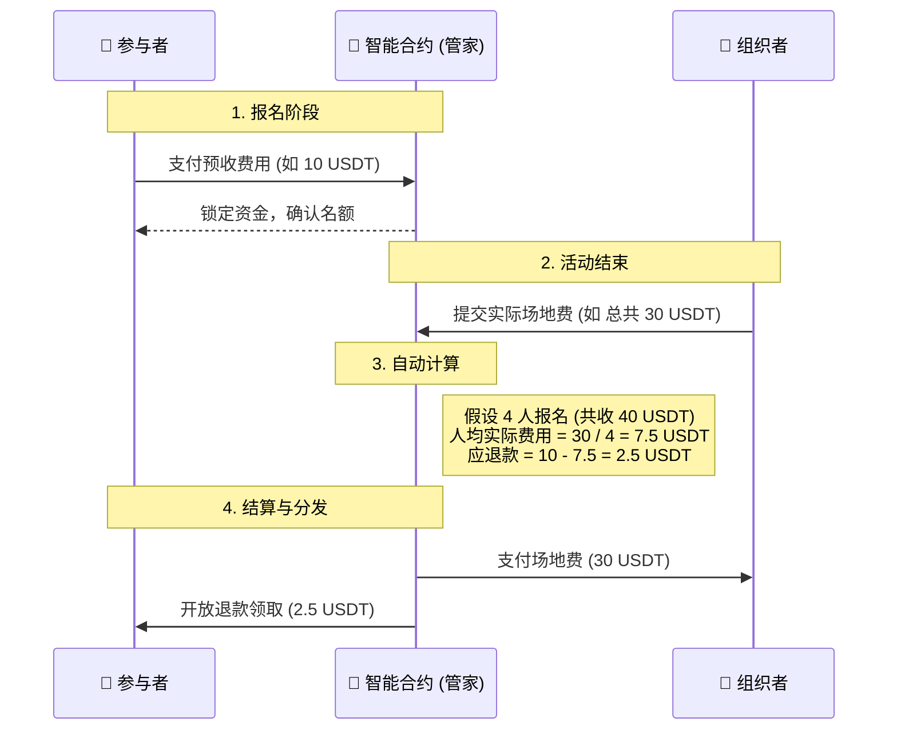
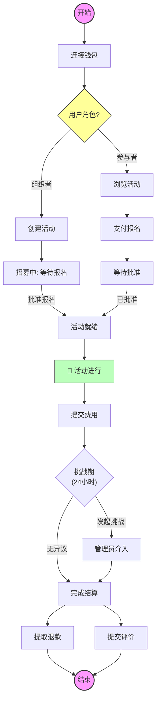

# 🏸 BadmintonTribe: 去中心化羽毛球活动管理平台

> **让每一次挥拍都纯粹，让每一笔费用都透明，让每一份成长和热爱都被铭记。**
> *Web3 时代的运动社群解决方案*

---

## 1. 项目背景 (Background)

羽毛球是一项团体活动，通常需由一个组织者发起。深圳这边商业羽毛球馆比如福田区最便宜的场地也是120RMB/小时；同时近两年羽毛球价格飞涨，深圳特产超牌羽毛球的红超系列身价已经高达20RMB/颗，组织羽毛球活动变得愈发艰难。

福田区商业场馆少，因此政府在非上课时间开放了部分学校的羽毛球场地，以50RMB/小时的价格提供给市民运动健身。这本来是一项公共福利，却被不少聪明人利用，直接通过自动化脚本抢订场地然后高价在哇友聚平台放出让别人报名。“黄牛”行为让很多羽毛球爱好者深恶痛绝。

对于羽毛球我是又菜又爱。最近在学solidity，就想结合web3的技术特点构建一个羽毛球活动组织平台，并尝试去解决一些常见问题：
*   **组织者风险**：组织者往往需要垫付场地费，如果参与者临时“鸽子”，组织者将承担经济损失。
*   **资金不透明**：活动费用的收支明细通常只有组织者自己知道，参与者难以核实资金去向。
*   **信任成本**：报名陌生人的球局如同开盲盒，因为互不了解技术级别（每个人对羽毛球业余技术等级的划分和理解都不太一样），可能会影响运动体验，高手发挥不出来，菜鸟感觉被遛。

**BadmintonTribe** 正是为了解决这些问题而生。通过尝试将活动组织流程搬上区块链，利用智能合约的公开、透明和自动执行特性，构建一个无需信任中介的运动社群。

---

## 2. 项目简介 (What is BadmintonTribe?)

**BadmintonTribe** 是一个基于区块链技术构建的羽毛球活动组织平台。它不仅仅是一个报名工具，更是一个**去中心化的资金托管与清算系统**。

在传统的羽毛球活动中，组织者（群主）往往面临记账繁琐、收钱难、退费麻烦等痛点；而参与者也担心预交费用的安全或账目不透明。BadmintonTribe 利用智能合约（Smart Contract）彻底解决了这些问题。

### 🌟 核心价值
*  **资金托管 (Escrow)**：参与者的报名费直接存入智能合约，而非打入组织者个人支付宝或者微信账户。
*  **透明结算 (Transparent Settlement)**：活动结束后，组织者必须公示账单或费用，合约自动计算人均费用。同时合约会启动公示期。每一笔交易、每一次退款都在链上可查，无法篡改。
*  **争议仲裁 (Dispute Resolution)**：如果组织者乱报账，任何人都可以质押保证金发起挑战。
*  **安全退款 (Pull Payment)**：采用“拉取式”退款设计，防止因 Gas 费不足或恶意攻击导致的退款失败。

---

## 3. 它是如何工作的？

这就好比我们有一个**绝对公正、永不休息的机器人管家**（智能合约），它帮我们管钱、分钱。

### 3.1 🔄 资金流转示意图

### 3.2 🗺️ 活动全生命周期流程图

---

## 4. 核心功能亮点

### ✅ 4.1 极简报名
不再需要在微信群里接龙刷屏。连接钱包，点击 "Join Event"，支付 USDT，一步搞定锁位。

### 🛡️ 4.2 防鸽子机制
报名即预付全款。如果有人临时“鸽子”不去，他依然需要分摊场地费，保障了到场球友的利益（人均费用不会因此暴涨）。

### 💸 4.3 多退少补？不，只退不补！
采用**预收费模式**（Pre-payment）。通常预收金额会略高于预计费用。活动结束后，合约会自动计算差额，参与者只需点击 "Claim" 即可领回结余。

### ⚖️ 4.4 争议仲裁
如果组织者乱填费用怎么办？在结算期内，任何人都可以发起**挑战 (Challenge)**。这会暂停资金发放，直到社区管理员介入裁决，确保资金安全。

---

## 5. 新手入门指南

### 第一步：连接钱包
点击右上角的 **Connect Wallet**。支持 MetaMask、Rainbow 等主流 Web3 钱包。
*(推荐使用测试网环境进行体验)*

### 第二步：领取测试币 (Testnet Only)
在首页顶部，你会看到一个黄色的 **Mint 1000 USDT** 按钮。点击它，您将获得用于测试的模拟稳定币。

### 第三步：浏览或创建活动
*   **我想报名打球**：浏览下方的活动列表，选择状态为 `Open` 的活动，点击进入。
*   **我想组织球局**：点击 `+ Create Event`，填写时间、地点、预收费用，一键发布上链。

### 第四步：参与与结算
1.  进入活动详情页，点击 **Approve USDT** (授权)，然后点击 **Join Event**。
2.  开心地去打球吧！🏸
3.  活动结束后，等待组织者结算。
4.  前往 **My Profile** 页面，查收并提取您的退款！

---

## 6. 用户旅程与功能解析

### 6.1 概览与钱包连接
用户进入首页，连接 MetaMask 钱包（支持 Hardhat 测试网）。首页清晰展示了当前开放报名的活动列表。

> **前端展示：**
> > *界面展示了活动列表，如“福田小学女双”，包含费用、时间和地点。*

### 6.2 发起活动 (Host)
任何人都可以成为组织者（Host）。在创建活动时，关键信息被写入链上结构体 `ActivityConfig` 。

* **智能合约逻辑**：
    * 调用 `createEvent` 函数 。
    * 设置关键参数：`feePerPerson` (人均费用)、`maxPlayers` (最大人数)、`minLevel` (等级限制) 。
    * **安全检查**：合约强制要求开始时间必须在未来，且至少 12 小时后，防止恶意闪电开团 。

> **前端展示：**
> > *Host 填写活动名称、场地、时间、费用、人数限制、技能等级限制等设置。*

### 6.3 报名与支付 (Host 或 Player)
通过 `joinEvent` 函数，玩家支付 USDT 报名费。此时资金进入合约托管，而非直接给 Host 。

* **状态管理**：玩家状态为 `Pending Approval`（待批准）。
* **防误触**：如果反悔，在被批准前可以调用 `withdrawApplication` 撤回申请并退款 。

> **前端展示：**
> > *玩家视角：显示“You have paid”，状态为等待批准。*

### 6.4 成员管理 (Host)
Host 在活动详情页管理报名人员。Web3 的透明性在这里体现为：只有被 Host 批准 (`approvePlayer`) 的玩家才算正式入局 。

* **操作流**：
    * **Approve**: 确认玩家参加。
    * **Cancel Event**: 如果人数不足，Host 可取消活动，触发全员退款机制 。
    * **Submit Expense**: 活动结束后，输入实际花费发起结算。

> **前端展示：**
> > *Host 视角：管理玩家列表（Pending/Approve），并可发起结算（Initiate Settlement）。*

### 6.5 结算与争议期 (核心机制)
这是本项目最“硬核”的 Web3 设计。活动结束后，Host 不能直接提款，必须经过一个 **挑战期 (Challenge Period)**。

* **流程**：Host 提交 `Total Actual Expense` -> 合约计算人均退款 -> 进入 24 小时公示期 。
* **挑战机制**：如果参与者发现费用虚报，可调用 `challengeSettlement` 发起挑战（需质押 5% 保证金以防恶意捣乱）。

> **前端展示：**
> > *底部展示了 "Submit Expense" 按钮，Host 需输入真实花费。*

### 6.6 管理员仲裁 (Admin)
如果发生争议，合约拥有者（Owner/DAO）通过 Admin Panel 介入。

* **裁决**：管理员调用 `resolveDispute` 判定谁胜诉。胜诉方将获得退款或押金奖励。

> **前端展示：**
> > *管理员后台：处理 Active Disputes。*

### 6.7 完成结算及资金提取 (Claim)
通过调用`finalizeSettlement`完成结算。结算完成后，多退少补。所有资金变更（Host 的收入、玩家的退款）都记录在 `withdrawableFunds` 映射中。

* **Pull Pattern**：用户必须主动点击 "Claim" 或相关按钮调用 `claimFunds` 提现，这是 Solidity 最佳实践，避免合约在转账时卡死。

> **前端展示：**
> > *个人中心：展示可提取余额。*

### 6.8 活动评价
通过调用`batchSubmitRatings` 或 `SubmitRating`进行活动评价，。仅活动参与者才能看到打分板。对Player的技能和Host的组织能力打分，不允许自评。

> **前端展示：**
> > * 活动参与者在活动详情页进行活动评价

---

## 7. 技术架构 (For Geeks)

本项目是一个标准的 Web3 DApp (去中心化应用)：

*   **前端 (Frontend)**: Next.js + Tailwind CSS
*   **交互 (Web3 Logic)**: Wagmi + Viem + RainbowKit
*   **合约 (Smart Contract)**: Solidity (运行在 EVM 兼容链上)
    * **ICourtside.sol**: 定义了核心接口、结构体（如 `PlayerInfo`, `ActivityConfig`）和事件，保证了代码的可读性和模块化。
    * **Courtside.sol**: 核心逻辑实现。
        * **继承**: 引入了 `ReentrancyGuard` 防止重入攻击，`Ownable` 进行权限控制。
        * **安全库**: 使用 `SafeERC20` 处理 USDT 转账。
        * **状态机**: 清晰定义的 `EventStatus` (Draft, Open, Settling, Completed, etc.) 管理活动生命周期。
*   **开发框架**: Hardhat

---

## 8. 未来计划 (Roadmap)

BadmintonTribe 还在持续进化中！

### 8.1 功能优化

*   🏆 **V1.1**: 引入 **SBT 勋章**，根据参加活动次数、出勤率、技能等级、活动组织能力评分等生成 SBT (Soulbound Token，灵魂绑定代币)
    * **参与型SBT:** 成功参与活动即铸造
    * **技能型SBT:** 基于参与人评分铸造SBT
    * **组织者信誉SBT:** 基于参与人对组织者的组织能力评分及组织活动次数等铸造SBT
*   🗳️ **V2.0**: 开启 **DAO 治理**
    * 让社区决定平台的服务费和规则；
    * 将争议仲裁权从 Admin 移交给社区委员会；
    * 黑名单仲裁投票
*   🚀 **V3.0**: 进行 **其他功能优化**，
    * 完善链上用户身份信息，如性别、昵称、技能等级；
    * 支持从已有活动复制和创建新活动，支持添加活动社交群的链接或二维码信息；
    * 强制要求host必须报名自己组织的活动；
    * 允许候补，当有人退出时按序转正；
    * 支持签到打卡；
    * 支持上传场地费收据/照片；
    * 支持对不同参与人设置不同结算金额。

### 8.2 技术优化
#### 8.2.1 前端
* **类型安全 (Type Safety)**: 前端代码中存在较多 `any` 类型（如 `const evt: any = eventData`）。可通过为合约返回的 Struct 定义严格的 TypeScript 接口，利用 `abitype` 自动生成类型，并通过编写简单的解析函数将链上数组转换为对象，减少运行时错误同时提升代码可读性。
* **乐观更新 (Optimistic Updates)**: 用户点击“Join”后，必须等待区块链确认（几秒到十几秒）才能看到 UI 变化，体验有延迟。使用 React Query 的乐观更新机制。点击按钮即立即在 UI 上显示“已加入”（灰色/加载态），后台等待上链确认，若失败再回滚状态，从而减少因必须等待区块链确认才能看到 UI 变化导致的体验延迟。
* **提取公共组件 (Component Abstraction)**: 目前在各个页面中，按钮和输入框的样式类名是重复硬编码的。可封装 `<Button />` 和 `<Input />` 组件，这样未来如果想修改主题只需改一个文件。
* **交互反馈**: 引入 Toast 通知系统（如 `sonner` 或 `react-hot-toast`），在 Monitor 交易状态时提供更友好的右上角弹窗提示，而非仅依赖按钮状态。
* **引入 Indexer (如 The Graph)**：部署Subgraph，通过监听链上事件（如 `EventCreated`, `PlayerJoined`），将数据索引到 GraphQL 数据库。前端直接查询 GraphQL，实现毫秒级的高效查询、分页搜索和过滤等功能。避免后续因活动增加导致页面加载极慢甚至 RPC 崩溃。

#### 8.2.2 智能合约
* **权限精细化 (Access Control)**: 目前仅使用了 `Ownable`（只有管理员）。通过引入 `AccessControl`，定义 `HOST_ROLE`, `ARBITRATOR_ROLE` (仲裁员) 等角色，实现去中心化治理的基础。
* **工厂模式 (Factory Pattern)**：如果未来逻辑升级，单体合约的数据迁移会很困难。可考虑将每个活动部署为独立的 Clone 合约（EIP-1167），或使用 Diamond 模式。
* **可升级设计 (Proxy Pattern)**: 目前合约是不可变的。如果未来想调整手续费逻辑或修复 Bug，必须重新部署新合约，导致旧数据丢失或迁移困难。采用 **UUPS (Universal Upgradeable Proxy Standard)** 代理模式。这样可以在保留数据存储（State）的前提下，仅升级逻辑合约（Logic Contract）。

---

## 9. 个人感悟
* **为什么要web3:** 做项目之前需要想明白web3能解决项目场景的哪些痛点，这些非web3不可的特质将是支撑项目远期规划的基础
* **加强前端技能:** 编写和修改前端代码很费token，所以如果懂前端会很省钱
* **把握迭代节奏:** 修复bug及代码优化要循序渐进，不要总想一步登天全部搞定整个大的，否则可能坠落深渊万劫不复
* **总结AI编程技巧:**
    * 定期删除与大模型的会话历史，否则因为历史缓存的关系会越来越费token
    * 每次开始新一轮对话时，先告诉项目背景及介绍主要功能让它了解项目概括，以免它在缺乏全局认识的情况下自以为是地乱改一通
    * 尽量给出具体的需求，一方面能省token，另一方面防止大模型注意力不集中
    * 修bug时如果已经确定错误原因并且基本能定位到代码片段，那就直接告诉大模型具体位置并让其修复，修复验证后再让举一反三检查其他相关项是否有类似问题

---

*加入 BadmintonTribe，畅享 Web3 带来的羽毛球运动新生活！*
